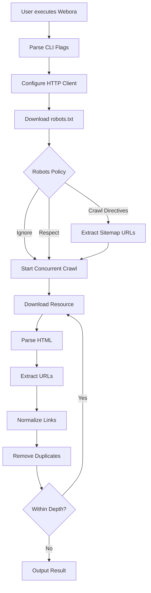
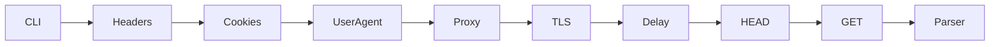
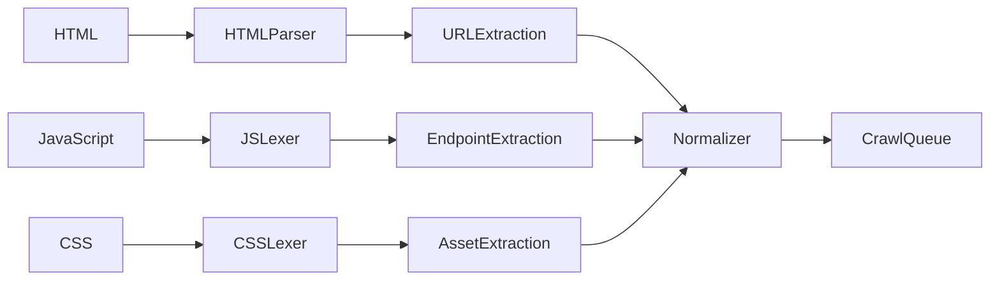
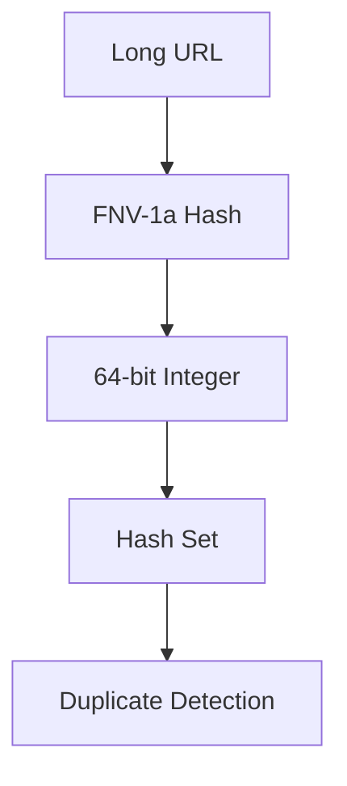
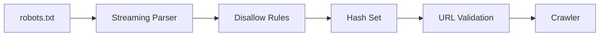

# Webora

<p align="center">
  
</p>

<p align="center">
  <strong>A high-performance command-line web crawler written in Go.</strong>
</p>

<p align="center">
  Crawl websites, extract hidden resources, respect or bypass robots policies, and discover application endpoints through a fast streaming architecture.
</p>

---

## Overview

Webora is a lightweight, concurrent web crawler designed for developers, security researchers, and automation engineers. Instead of relying on browser automation or building large DOM trees in memory, Webora processes web content as streaming data, enabling fast crawling with a significantly smaller memory footprint.

It is capable of discovering URLs from HTML documents, JavaScript, CSS, forms, assets, comments, and sitemaps while providing extensive request customization through a modern CLI interface.

---

# Architecture

```text
                   +----------------+
                   |     CLI        |
                   | Flag Parsing   |
                   +-------+--------+
                           |
                           ▼
                Configuration Builder
                           |
                           ▼
                Request Configuration
      (Headers, Cookies, UA, Proxy, TLS)
                           |
                           ▼
                 Concurrent Worker Pool
                           |
                           ▼
                  HTTP Request Engine
                           |
          +----------------+----------------+
          |                                 |
          ▼                                 ▼
    robots.txt                     Target Resources
          |                                 |
          ▼                                 ▼
   Robots Parser                 HTML / JS / CSS Parser
          |                                 |
          +---------------+-----------------+
                          ▼
                  URL Normalization
                          ▼
                 Duplicate Elimination
                          ▼
                    Crawl Scheduler
                          ▼
                    Stream to stdout
```

---

# Crawl Workflow



---

# Request Pipeline

Webora's request layer is designed to mimic real browser traffic while remaining lightweight.



Supported request capabilities include:

- Custom request headers
- Custom cookies
- User-Agent spoofing
- Proxy support
- Proxy authentication
- Configurable request delays
- Optional HEAD pre-flight optimization
- TLS verification control
- Request timeout configuration

---

# Streaming Parsing Pipeline

Instead of constructing complete DOM trees, Webora parses documents as continuous streams.



This streaming architecture allows Webora to:

- Process pages immediately as data arrives.
- Reduce memory allocations.
- Handle large documents efficiently.
- Discover endpoints hidden inside JavaScript and CSS.
- Maintain high crawl throughput.

---

# Memory Optimization

Large-scale crawling can consume significant amounts of memory when millions of URLs are discovered.

Webora minimizes resource consumption through several optimizations.



### Optimizations

- Streaming HTML parsing without DOM construction
- FNV-1a hashing for compact URL storage
- Constant-time duplicate detection
- MIME-type filtering before parsing
- File-extension pre-screening
- Configurable worker pool
- Configurable crawl depth

---

# robots.txt Processing



Depending on configuration, Webora can:

- Ignore robots rules
- Respect robots directives
- Extract sitemap declarations
- Crawl directive URLs for additional discovery

---

# Link Discovery Sources

Webora discovers URLs from multiple sources during a crawl.

| Source        | Description                                                      |
| ------------- | ---------------------------------------------------------------- |
| HTML          | Anchors, images, forms, scripts, stylesheets and media resources |
| JavaScript    | API endpoints, fetch requests and embedded URLs                  |
| CSS           | `url()` properties and imported assets                           |
| HTML Comments | Optional brute-force discovery of forgotten endpoints            |
| robots.txt    | Disallow rules and sitemap declarations                          |

---

# Usage

```bash
webora [flags] <url>
```

### Crawl a website

```bash
webora https://example.com
```

### Unlimited crawl depth

```bash
webora -depth -1 https://example.com
```

### Extract JavaScript endpoints

```bash
webora -js https://example.com
```

### Scan HTML comments

```bash
webora -brute https://example.com
```

### Respect robots.txt

```bash
webora -robots respect https://example.com
```

### Use a proxy

```bash
webora \
  -proxy-auth user:password \
  -user-agent "Mozilla/5.0" \
  https://example.com
```

---

# Common Flags

| Flag          | Description                      |
| ------------- | -------------------------------- |
| `-depth`      | Maximum crawl depth              |
| `-workers`    | Concurrent workers               |
| `-delay`      | Delay between requests           |
| `-timeout`    | HTTP timeout                     |
| `-header`     | Custom request headers           |
| `-cookie`     | Custom cookies                   |
| `-user-agent` | User-Agent override              |
| `-robots`     | robots.txt policy                |
| `-proxy-auth` | Proxy authentication             |
| `-skip-ssl`   | Disable certificate verification |
| `-subdomains` | Include subdomains               |
| `-headless`   | Skip HEAD pre-flight requests    |
| `-js`         | Parse JavaScript                 |
| `-css`        | Parse CSS                        |
| `-brute`      | Scan HTML comments               |

---

# Performance Highlights

✔ Concurrent worker pool

✔ Streaming SAX HTML parser

✔ JavaScript lexical parsing

✔ CSS lexical parsing

✔ Constant-time duplicate detection

✔ Minimal memory allocations

✔ Configurable crawl depth

✔ Optimized request pipeline

✔ MIME-aware resource filtering

✔ Cross-platform CLI

---

# Build

```bash
git clone https://github.com/your-username/webora

cd webora

go build -o webora ./cmd/webora
```

---

# Example

```bash
webora \
    -depth 3 \
    -workers 16 \
    -delay 150ms \
    -robots respect \
    -js \
    -css \
    https://example.com
```

---

# Philosophy

Webora is built around a simple principle:

> **Process data as streams, minimize memory usage, maximize crawl throughput, and provide a flexible command-line interface that scales from small websites to large web applications.**

# Rather than depending on heavyweight browser automation, Webora performs efficient HTTP crawling using optimized parsers, configurable networking, and concurrent execution to achieve fast and predictable performance.


> > > > > > > b9bf68360a252534cff022bb299dbbed31010e3d
> > > > > > > 9f854a2abcc2b98563c6ddfdd12bcee7f0fa60e4
